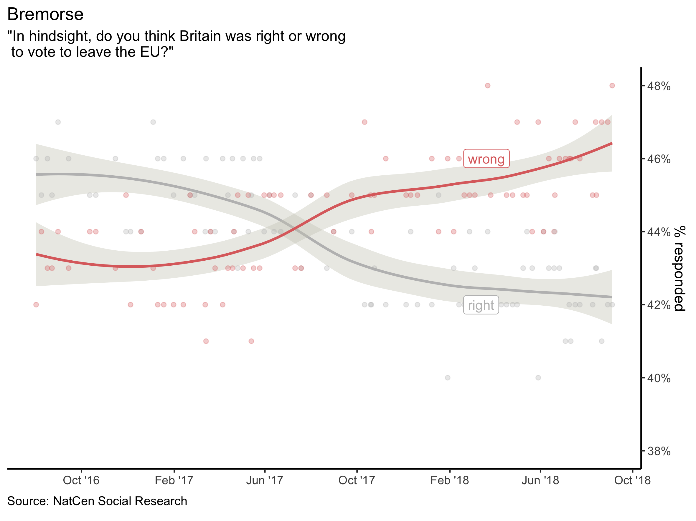

# tidytuesday-economist-remakes
TidyTuesday had a task of redesigning the charts Economist mentioned at some point. Here is the original article: https://medium.economist.com/mistakes-weve-drawn-a-few-8cdd8a42d368

Original chart I chose to work with:

Original chart ("better") made in R:

I did a small makeover to show the "remorse" part in more detail:

I like named y axis and I also prefer to have percentage sign there. As for "Wrong" being the highlight - the original chart is called Bremorse and (I guess) is meant to show the increase of people who believe their decision to vote "Leave" was wrong. In that case, I'd remove the highlight from "Right" and only focus readers' attention on "Wrong".

Original data: https://github.com/rfordatascience/tidytuesday/tree/master/data/2019/2019-04-16 

Libraries used: 

- tidyverse
- lubridate
- scales
- ggthemes
- magrittr
- gridExtra
- ggrepel
- cowplot
